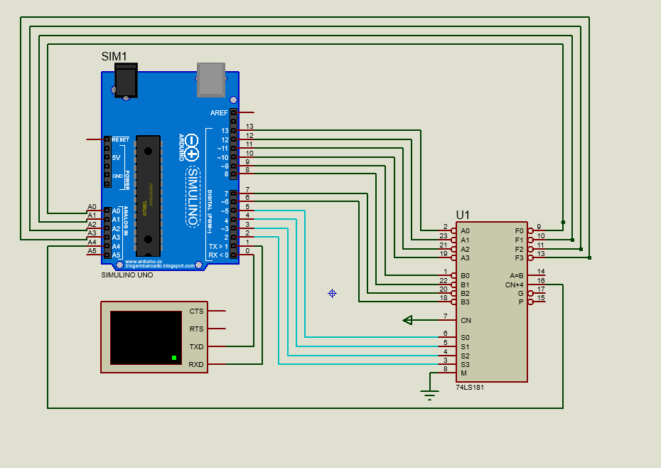

<h1 align="center">ALU Multiplicación División</h1>

Este proyecto es el resultado del primer parcial de la materia de Organización Computacional.

<h1 align="center">Tecnologías Utilizadas</h1>

  
  

<h1 align="center">Detalles del Proyecto</h1>

Este proyecto consiste en implementar la multiplicación y la división en Proteus, utilizando código c++ en el IDE de Arduino. Incorporando componentes electrónicos como el Arduino UNO, la terminal virtual y una ALU. 

<h1 align="center">Características Destacadas</h1>
<ul>
  <li><b>Proteus:</b> Está desarrollado en un simulador de circuitos electrónicos por lo que puede ser probado por los usuarios que cuenten con el programa.</li>
  <li><b>4 bits:</b> Las operaciones se realizan con operandos de 4 bits, por su parte la multiplicación puede arrojar resultados de hasta 5 bits.</li>
</ul>

<h1 align="center">Interfaz</h1>

  

